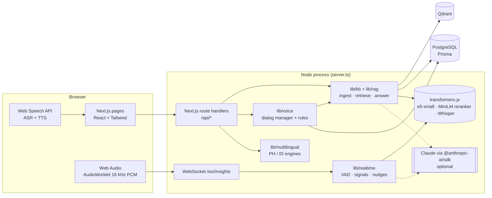
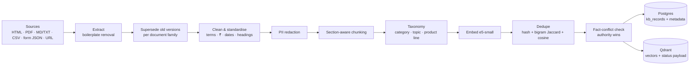
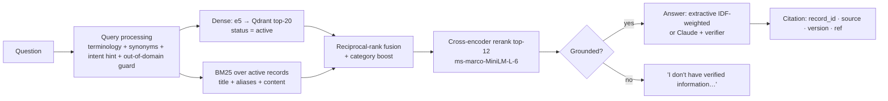
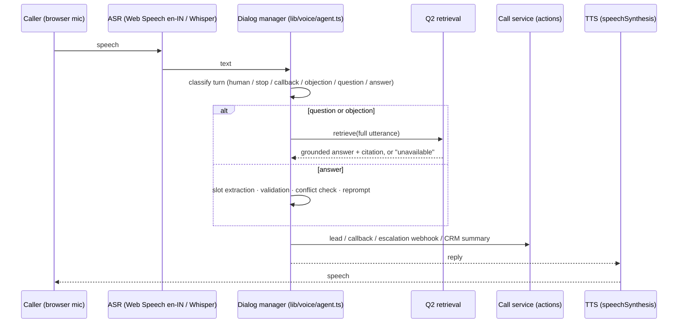
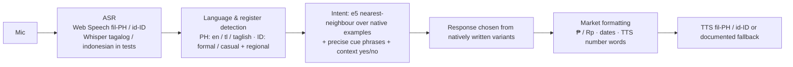

# Architecture

One Next.js 16 (App Router) + TypeScript application. A small custom server (`server.ts`) runs Next.js and a WebSocket endpoint in the **same Node process**. Next.js route handlers can't hold a persistent WebSocket, and Q4 needs one. Postgres (Prisma) holds structured data. Qdrant holds vectors. All ML that has to run without credentials runs locally through transformers.js (ONNX on CPU): multilingual embeddings, a cross-encoder reranker, and Whisper ASR. Claude is optional and only rewrites wording; every decision is deterministic and auditable.



## Q2 – Knowledge base (built first; Q1 depends on it)



| Stage | Implementation | File |
|---|---|---|
| Source registry | `data/raw/manifest.json` with `family`, `version`, `authority` (3 = approved policy, 2 = brochure/table, 1 = website) | `lib/kb/ingest.ts` |
| HTML / web extraction | cheerio; drops `nav, header, footer, aside, script, form`, cookie/promo/CTA blocks; headings become sections; tables become one sentence per row; URLs are fetched with a timeout + content-type check | `lib/kb/extract.ts` |
| PDF parsing | unpdf (pdf.js); a line repeated on ≥ 50 % of pages (digits masked) is treated as header/footer; "Page x of y" removed; wrapped lines re-joined; corrupt or scanned PDFs fail with a clear "route to OCR" error and are recorded as `failed` | `lib/kb/extract.ts` |
| Tables / forms | CSV rows de-duplicated, then linearised per plan; form labels mapped to canonical fields (`Mobile No.` → `phone`, `PED (Y/N)` → `has_pre_existing_disease`); sample submissions with personal data are dropped | `lib/kb/extract.ts` |
| Cleaning | terminology map (pre existing illness → pre-existing disease, cooling period → waiting period, mediclaim → health insurance), `Rs./INR` → `₹`, dates → ISO, **invalid dates flagged** (31/02/2026), heading case | `lib/kb/clean.ts` |
| PII | email, Indian mobile, Aadhaar, PAN, policy number, person names in attributions. Redacted **before** storage/embedding; business contacts allow-listed; `contains_pii` + `pii_types` kept | `lib/kb/pii.ts` |
| Chunking | one chunk per section / FAQ item; sections over 140 words split on sentence boundaries into ~110-word windows with one sentence of overlap (voice answers come from one chunk) | `lib/kb/chunk.ts` |
| Taxonomy | `category` (product, pricing, eligibility, policy, claims, faq, objection, process, partnership, company), `topic` (keyword-scored, heading ×3), `product_line` | `lib/kb/taxonomy.ts` |
| Dedupe | exact = normalised SHA-256; near = bigram Jaccard ≥ 0.6 **or** (cosine ≥ 0.98 and Jaccard ≥ 0.3). The winner is chosen by authority → version → length; the loser's title is kept as an **alias** of the winner (alternate phrasing) | `lib/kb/dedupe.ts` |
| Conflicts | extracts business facts (PED waiting period, initial waiting period, max entry age); a lower-authority record that disagrees is `flagged` and excluded from answers | `lib/kb/facts.ts` |
| Versioning | document `version` + `effective_date`; older family versions `superseded`; per record a stable key, `content_hash` and `revision` (bumped when content changes); each run stored in `IngestionRun` with added/changed/unchanged/removed counts | `lib/kb/ingest.ts` |

**Record schema** (`prisma/schema.prisma` → `KbRecord`):

```json
{
  "record_id": "kb_partnership_001",
  "title": "Branch Partnership Benefits",
  "content": "Operational, marketing, and technology support is provided to branch partners. …",
  "category": "partnership",
  "product_line": "all",
  "source": "website / partners section",
  "source_ref": "website/partners.html#branch-partnership-benefits",
  "version": "2026.09",
  "contains_pii": false,
  "pii_types": [],
  "status": "active | duplicate | superseded | flagged",
  "duplicate_of": null,
  "content_hash": "…",
  "metadata": { "key": "web_partners:…:0", "topic": "partnership", "authority": 1, "revision": 1, "effectiveDate": null, "normalizations": [], "flags": [], "aliases": [] }
}
```

### Retrieval and answering



- **Grounding rule.** The answer is grounded if: (1) the question is not out-of-domain, **and** (2) one of these holds: the cross-encoder logit is ≥ 0; it is ≥ −2.5 and dense cosine is ≥ 0.85; or the top record is an objection and the caller's statement paraphrases it (symmetric e5 ≥ 0.87). The thresholds were calibrated on the dev/calibration sets only (`docs/evaluation/retrieval-calibration.json`). If the reranker can't load, retrieval falls back to dense + lexical thresholds.
- **Answers.** Without an LLM key, the answer is extractive: the two most informative sentences of the top record (query-term IDF weighting, title words discounted), and playbook instructions ("Explain that…") are rewritten as customer speech. With `LLM_API_KEY` set, Claude rewrites the records into at most two spoken sentences, and a **verifier** rejects the output if it cites a record that wasn't supplied or contains a number that isn't in the sources. In that case the extractive answer is used instead.
- **Citations.** Each answer carries `record_id`, title, source, version and source reference, and they're shown in the UI and the transcripts.

## Q1 – Voice agent (uses Q2)



- **Script and business rules** are configuration (`data/business/health-lead-qualification.json`): greeting with an AI and recording disclosure, slot prompts and reprompts, and the qualification rules (age 18–65, parents ≤ 75 and only on Gold/Platinum, conditions that need underwriting, minimum budget, plan bands). **FAQs, objections, policies and prices are not in the script or the prompt.** Every answer is retrieved from Q2 at run time. The one script-driven KB lookup is the PED waiting period at qualification time, and that is retrieved too.
- **State machine.** consent → slots (name, age, members, parent age, city, health, smoker, budget) → qualification → next step (callback / quote) → close. Human escalation, stop, and callback requests are honoured at any stage. Conflicting values (e.g. "I'm 43" then "I'm 34") trigger a confirmation question. After 2 failed reprompts the slot is marked for the advisor, except age, which escalates.
- **Business actions** (`lib/voice/service.ts`): lead creation, callback scheduling, a mock CRM summary with unanswered questions and data-quality notes, and an escalation webhook (`ESCALATION_WEBHOOK_URL`, otherwise stored in `CrmAction`). Hanging up mid-call still writes a CRM summary.

## Q3 – Localized bots



- Market packs (`data/markets/ph.json`, `id.json`) hold the flow, customer context, intents with example utterances in every register, and **separately written** responses per variant. There is no runtime translation.
- The variant is detected on every turn and is sticky. It switches only on confident evidence, so a single English loanword (premium, policy, DP, transfer) doesn't flip the reply language.
- Identity is checked before any account detail is disclosed. A wrong-party answer ends the call politely.
- Low-confidence turns get a fallback in the caller's language and register ("Pasensya na po…", "Mohon maaf…" / "Maaf, Pak…").

## Q4 – Live insights

```mermaid
flowchart LR
  S1[Live mic AudioWorklet<br/>or real-time replay<br/>100 ms frames] --> V[Per-speaker VAD segmenter<br/>adaptive noise floor · 500 ms endpoint · 6 s max]
  V --> W[Whisper-base ASR<br/>serialized queue]
  W --> X[Signal extractor<br/>rules + negation / external-target / hallucination guards<br/>+ call context]
  X --> N[Nudge engine<br/>threshold · group/merge · cooldown · cap · rate-limit defer · TTL · resolve]
  N --> O[optional Claude phrasing<br/>1.5 s budget]
  O --> WS[WebSocket event]
  WS --> D[Dashboard renders → ack]
  D -- ack --> L[Latency: delivery + end-to-end]
```



- **Streaming input.** In replay mode a stereo recording (L = agent, R = customer) is pushed in 100 ms frames on a drift-corrected wall-clock schedule (`lib/realtime/replay.ts`). Nothing is pre-analysed. Live mic mode streams PCM16 from an AudioWorklet over the same socket, with a speaker toggle (mono mic can't be diarised).
- **Signals.** Missing recording disclosure (fires once the agent talks price/payment, or at 40 s), risky promises ("guaranteed", "always approved", "100 %"), cross-sell (second vehicle, uninsured family), payment difficulty, rising frustration (scored per utterance, trend over the last 3), callback need, buying signal, churn risk. Confidence is scaled down for low SNR and short utterances, and Whisper's typical noise hallucinations ("Thank you.", "you") are dropped.
- **Nudge control.** Per-type confidence floor; one active nudge per topic group, with repeats merged (×n); per-group cooldown; per-call cap; non-urgent nudges spaced ≥ 10 s apart (deferred, not dropped); TTL expiry; resolution when the agent acts (e.g. says "this call is recorded").
- **Latency.** Every stage is timestamped with `performance.now()` in the server process. The dashboard (or the benchmark client) acks after rendering. See `LATENCY_REPORT.md`.

## Key design decisions

| Decision | Why | Trade-off |
|---|---|---|
| Deterministic dialog managers; LLM only for phrasing | Reliable, testable, explainable decisions; no hallucinated qualification outcomes | Less flexible language understanding than an LLM agent |
| Local embeddings, reranker and Whisper | Works with no credentials; no PII leaves the machine; latency is measurable and repeatable | CPU inference; Whisper-base is weaker than cloud ASR on accents and noise |
| Hybrid retrieval + cross-encoder + explicit grounding threshold | Embedding cosine alone was not calibrated enough to decide "answer vs refuse" (measured, see evaluation) | ~100 ms retrieval instead of ~10 ms |
| Custom server for WebSockets | Q4 needs push; the code stays in one TypeScript process | No serverless (Vercel) deployment for the socket; needs a Node host |
| Stereo channels for speaker separation | Contact-centre recordings are usually dual-channel; avoids a diarisation model | Mono live mic needs a manual speaker toggle |
